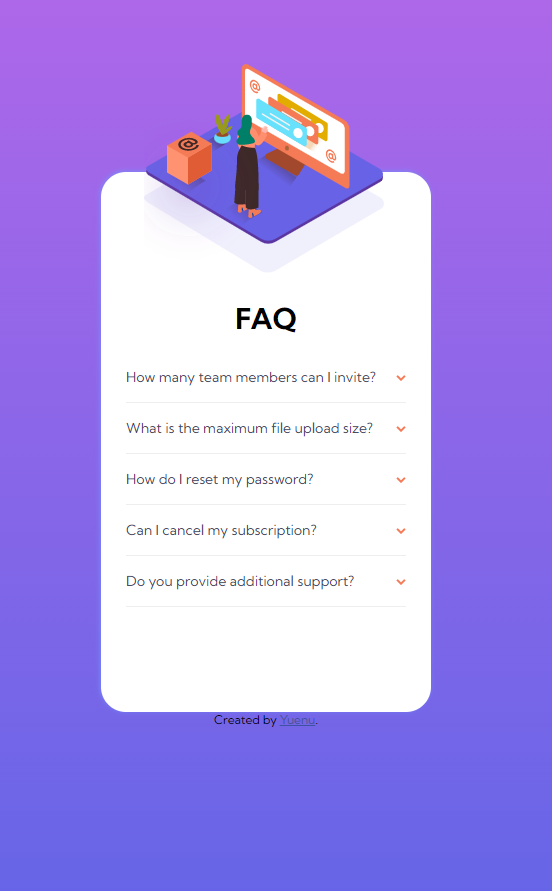

# Frontend Mentor - FAQ accordion card solution

This is a solution to the [FAQ accordion card challenge on Frontend Mentor](https://www.frontendmentor.io/challenges/faq-accordion-card-XlyjD0Oam). Frontend Mentor challenges help you improve your coding skills by building realistic projects.

## Table of contents

- [Overview](#overview)
  - [The challenge](#the-challenge)
  - [Screenshot](#screenshot)
  - [Links](#links)
- [My process](#my-process)
  - [Built with](#built-with)
  - [What I learned](#what-i-learned)
- [Author](#author)

## Overview

### The challenge

Users should be able to:

- View the optimal layout for the component depending on their device's screen size
- See hover states for all interactive elements on the page
- Hide/Show the answer to a question when the question is clicked

### Screenshot

***Desktop***


***Mobile***



### Links

- Solution URL: [Repo](https://github.com/yuenu/layout-practice/tree/main/frontendmentor/component/FAQ-component)
- Live Site URL: [Live demo](https://yuenu.github.io/layout-practice/frontendmentor/component/FAQ-component/)

## My process

### Built with

- Semantic HTML5 markup
- CSS custom properties
- Flexbox
- Desktop-first workflow
- Vanilla.js

### What I learned

[***html details-tag***](https://developer.mozilla.org/en-US/docs/Web/HTML/Element/details)

```html
<details>
    <summary>Details</summary>
    Something small enough to escape casual notice.
</details>

```

***The box animation***

```css
animation: 1.1s updown infinite alternate;

@keyframes updown {
  from {
    -webkit-transform: translateY(1.875em);
    transform: translateY(1.875em);
  }
  to {
    -webkit-transform: translateY(0.938em);
    transform: translateY(0.938em);
  }
}
```

## Author

- Website - [yuenu](https://yuenu.github.io/profile/)
- Frontend Mentor - [@yuenu](https://www.frontendmentor.io/profile/yuenu)
