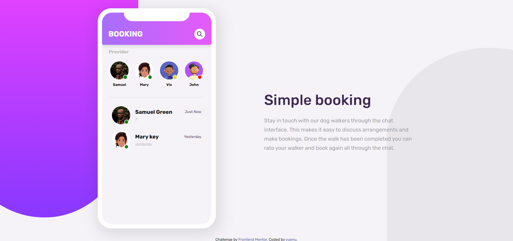
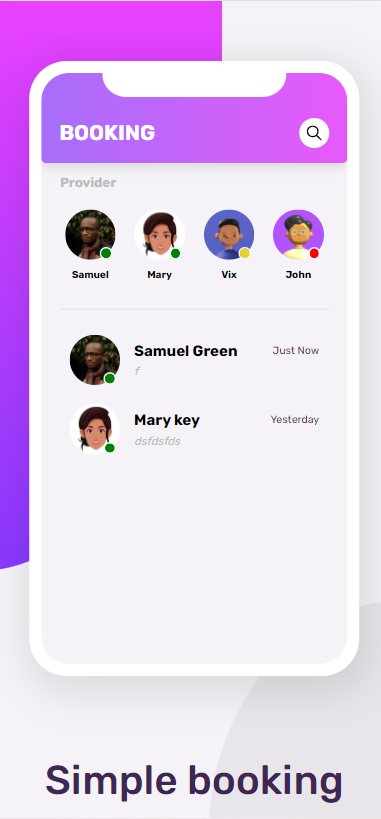

# Frontend Mentor - Chat app CSS illustration solution

This is a solution to the [Chat app CSS illustration challenge on Frontend Mentor](https://www.frontendmentor.io/challenges/chat-app-css-illustration-O5auMkFqY). Frontend Mentor challenges help you improve your coding skills by building realistic projects. 

## Table of contents

- [Overview](#overview)
  - [The challenge](#the-challenge)
  - [Screenshot](#screenshot)
  - [Links](#links)
- [My process](#my-process)
  - [Built with](#built-with)
  - [What I learned](#what-i-learned)
  - [Continued development](#continued-development)
  - [Useful resources](#useful-resources)
- [Author](#author)
- [Acknowledgments](#acknowledgments)

**Note: Delete this note and update the table of contents based on what sections you keep.**

## Overview

### The challenge

Users should be able to:

- View the optimal layout for the component depending on their device's screen size
- **Bonus**: See the chat interface animate on the initial load

### Screenshot



***Mobile***



### Links

- Solution URL: [Repo](https://your-solution-url.com)
- Live Site URL: [Live demo](https://your-live-site-url.com)

## My process

### Built with

- Semantic HTML5 markup
- CSS custom properties
- Flexbox
- Destop-first workflow
- Vanilla.js


**Note: These are just examples. Delete this note and replace the list above with your own choices**

### What I learned

When user sent message, and the message add to the body automatic scroll to bottom

```js
textBody.scrollTop = textBody.scrollHeight
```

[Node.contains()](https://developer.mozilla.org/en-US/docs/Web/API/Node/contains)


```js
node.contains( otherNode )
```

### Continued development

There are some bug need to fix
- [ ] When user submit message,if return to the home page, 
- [ ] 
- [ ] 
- [ ] 

## Author


- Website - [yuenu](https://yuenu.github.io/profile/)
- Frontend Mentor - [@yuenu](https://www.frontendmentor.io/profile/yuenu)