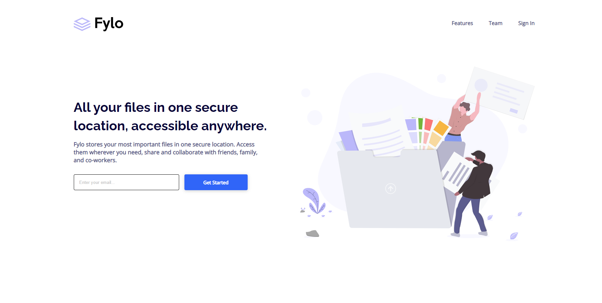

# Frontend Mentor - Fylo landing page with two column layout solution

This is a solution to the [Fylo landing page with two column layout challenge on Frontend Mentor](https://www.frontendmentor.io/challenges/fylo-landing-page-with-two-column-layout-5ca5ef041e82137ec91a50f5). Frontend Mentor challenges help you improve your coding skills by building realistic projects.

## Table of contents

- [Overview](#overview)
  - [The challenge](#the-challenge)
  - [Screenshot](#screenshot)
  - [Links](#links)
- [My process](#my-process)
  - [Built with](#built-with)
- [Author](#author)

**Note: Delete this note and update the table of contents based on what sections you keep.**

## Overview

### The challenge

Users should be able to:

- View the optimal layout for the site depending on their device's screen size
- See hover states for all interactive elements on the page

### Screenshot

**_Desktop_**



**_Mobile_**


### Links

- Solution URL: [Repo](https://github.com/yuenu/layout-practice/tree/main/frontendmentor/component/fylo-landing-page-with-two-column-layout-master)
- Live Site URL: [Live demo](https://yuenu.github.io/layout-practice/frontendmentor/component/fylo-landing-page-with-two-column-layout-master/)

## My process

### Built with

- Semantic HTML5 markup
- CSS custom properties
- Flexbox
- Desktop-first workflow


### What I learned

I use [min()](https://developer.mozilla.org/en-US/docs/Web/CSS/min()) to responsive different screen size 

But when I apply my scss file, it happens compile wrong

`Internal Error: Incompatible units: 'px' and '%'.`

so I found the [issue](https://github.com/sass/node-sass/issues/2815) on github, and i add calc before min

```css
width: calc(min(90%, 1400px));
```


## Author

- Website - [yuenu](https://yuenu.github.io/profile/)
- Frontend Mentor - [@yuenu](https://www.frontendmentor.io/profile/yuenu)
