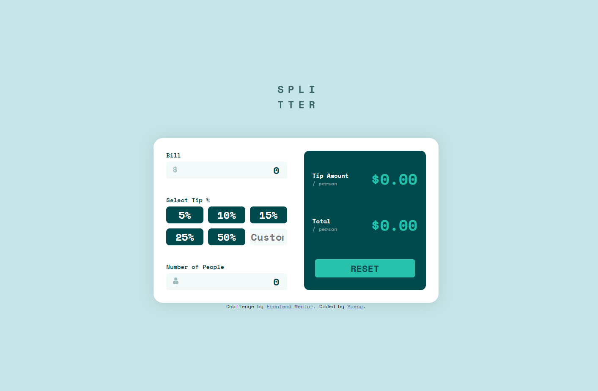
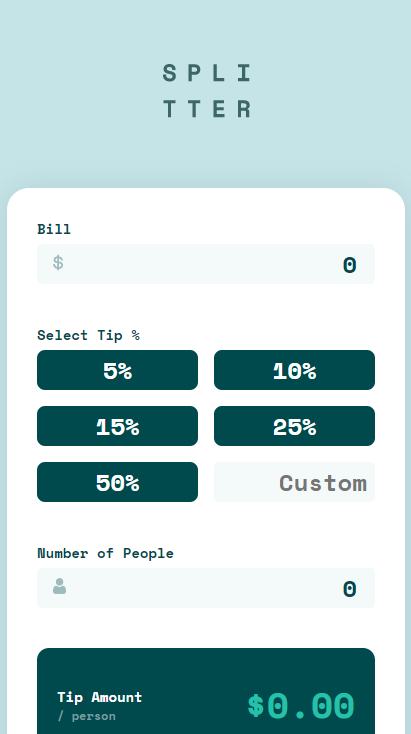

# Frontend Mentor - Tip calculator app solution

This is a solution to the [Tip calculator app challenge on Frontend Mentor](https://www.frontendmentor.io/challenges/tip-calculator-app-ugJNGbJUX). Frontend Mentor challenges help you improve your coding skills by building realistic projects.

## Table of contents

- [Overview](#overview)
  - [The challenge](#the-challenge)
  - [Screenshot](#screenshot)
  - [Links](#links)
- [My process](#my-process)
  - [Built with](#built-with)
  - [What I learned](#what-i-learned)
- [Author](#author)

## Overview

### The challenge

Users should be able to:

- View the optimal layout for the app depending on their device's screen size
- See hover states for all interactive elements on the page
- Calculate the correct tip and total cost of the bill per person

### Screenshot

**_Desktop_**



**_Desktop_**



### Links

- Solution URL: [Repo](https://github.com/yuenu/layout-practice/tree/main/frontendmentor/component/tip-calculator-app-main)
- Live Site URL: [Live demo](https://yuenu.github.io/layout-practice/frontendmentor/component/tip-calculator-app-main/)

## My process

### Built with

- Semantic HTML5 markup
- CSS custom properties
- Flexbox
- Desktop-first workflow
- Vanilla.js

### What I learned

[_To hidden input outer-spin-button_](https://developer.mozilla.org/en-US/docs/Web/CSS/::-webkit-outer-spin-button)

```css
input::-webkit-outer-spin-button {
  -webkit-appearance: none;
}
```

[Object.defineProperty()](https://developer.mozilla.org/en-US/docs/Web/JavaScript/Reference/Global_Objects/Object/defineProperty)

```js
const object1 = {};

Object.defineProperty(object1, "property1", {
  value: 42,
  writable: false,
});

object1.property1 = 77;
// throws an error in strict mode

console.log(object1.property1);
// expected output: 42
```

Reference from [Tee](https://www.frontendmentor.io/solutions/using-vanillajs-and-sass-and-bem-FUX_vwlRj#comment-614c328b55d6377f0f6941cf) :

The numbers on the `output section` expand the container when they get very long. I suggest giving them a `maximum width` incase they get very long and also give them a property of `overflow : scroll` so that the number is scrollable and won't stay hidden, and also add this to hide the scroll bar as it doesn't look good`::-webkit-scrollbar{display: none}`.

**And i fixed this way, add this to the output display**

```css
.output-className {
  overflow: scroll;
  &::-webkit-scrollbar {
    display: none;
  }
}
```

## Author

- Website - [yuenu](https://yuenu.github.io/profile/)
- Frontend Mentor - [@yuenu](https://www.frontendmentor.io/profile/yuenu)
