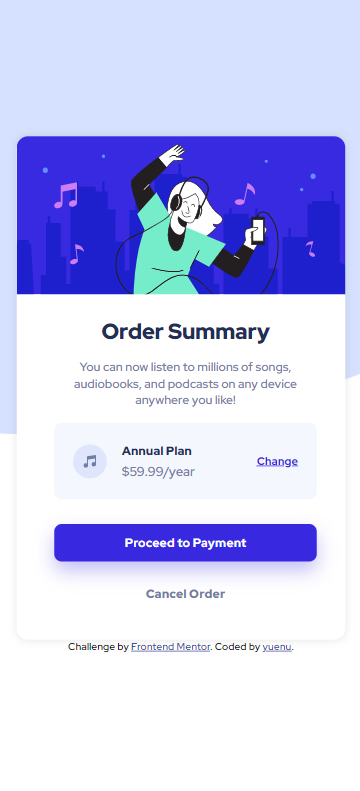

# Frontend Mentor - Order summary card solution

This is a solution to the [Order summary card challenge on Frontend Mentor](https://www.frontendmentor.io/challenges/order-summary-component-QlPmajDUj). Frontend Mentor challenges help you improve your coding skills by building realistic projects.

## Table of contents

- [Overview](#overview)
  - [The challenge](#the-challenge)
  - [Screenshot](#screenshot)
  - [Links](#links)
- [My process](#my-process)
  - [Built with](#built-with)
  - [What I learned](#what-i-learned)
  - [Continued development](#continued-development)
  - [Useful resources](#useful-resources)
- [Author](#author)

**Note: Delete this note and update the table of contents based on what sections you keep.**

## Overview

### The challenge

Users should be able to:

- See hover states for interactive elements

### Screenshot

**_Desktop_**


**_Mobile_**



### Links

- Solution URL: [Repo](https://github.com/yuenu/layout-practice/tree/main/frontendmentor/order-summary-component-main)
- Live Site URL: [Live demo](https://yuenu.github.io/layout-practice/frontendmentor/order-summary-component-main/)

## My process

### Built with

- Semantic HTML5 markup
- CSS custom properties
- Flexbox
- CSS Grid
- Desktop-first workflow

### What I learned

Spinner
[ref](https://loading.io/css/)

```css
.lds-ring {
  display: inline-block;
  position: relative;
  width: 30px;
  height: 30px;
}
.lds-ring div {
  box-sizing: border-box;
  display: block;
  position: absolute;
  width: 24px;
  height: 24px;
  margin: 3px;
  border: 4px solid #fff;
  border-radius: 50%;
  animation: lds-ring 1.2s cubic-bezier(0.5, 0, 0.5, 1) infinite;
  border-color: #fff transparent transparent transparent;
}
.lds-ring div:nth-child(1) {
  animation-delay: -0.45s;
}
.lds-ring div:nth-child(2) {
  animation-delay: -0.3s;
}
.lds-ring div:nth-child(3) {
  animation-delay: -0.15s;
}
@keyframes lds-ring {
  0% {
    transform: rotate(0deg);
  }
  100% {
    transform: rotate(360deg);
  }
}
```

To detect credit card tyoe

[ref](https://stackoverflow.com/questions/5911236/identify-card-type-from-card-number)

```js
function GetCardType(number) {
  // visa
  var re = new RegExp("^4");
  if (number.match(re) != null) return "Visa";

  // Mastercard
  // Updated for Mastercard 2017 BINs expansion
  if (
    /^(5[1-5][0-9]{14}|2(22[1-9][0-9]{12}|2[3-9][0-9]{13}|[3-6][0-9]{14}|7[0-1][0-9]{13}|720[0-9]{12}))$/.test(
      number
    )
  )
    return "Mastercard";

  // AMEX
  re = new RegExp("^3[47]");
  if (number.match(re) != null) return "AMEX";

  // Discover
  re = new RegExp(
    "^(6011|622(12[6-9]|1[3-9][0-9]|[2-8][0-9]{2}|9[0-1][0-9]|92[0-5]|64[4-9])|65)"
  );
  if (number.match(re) != null) return "Discover";

  // Diners
  re = new RegExp("^36");
  if (number.match(re) != null) return "Diners";

  // Diners - Carte Blanche
  re = new RegExp("^30[0-5]");
  if (number.match(re) != null) return "Diners - Carte Blanche";

  // JCB
  re = new RegExp("^35(2[89]|[3-8][0-9])");
  if (number.match(re) != null) return "JCB";

  // Visa Electron
  re = new RegExp("^(4026|417500|4508|4844|491(3|7))");
  if (number.match(re) != null) return "Visa Electron";

  return "";
}
```

### Continued development

[x] - detech credit card type

### Useful resources

- [CSS spinner](https://loading.io/css/) - It's used simply HTML & CSS, made beautiful spinner animation
- [SVG animation](https://www.youtube.com/watch?v=gWai7fYp9PY&t=74s) - Dev Ed use a simply way to make SVG animation

## Author

- Website - [yuenu](https://yuenu.github.io/profile/)
- Frontend Mentor - [@yuenu](https://www.frontendmentor.io/profile/yuenu)
